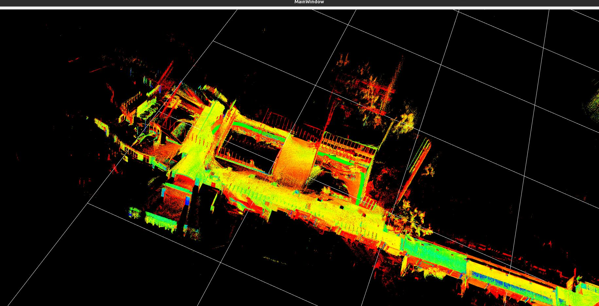

# SLAM-TOOLBOX-QT
## 安装

## 运行

1. 启动python端读取rosbag并发送数据
```bash
python exampls/ros/RosBagReader.py 
```
2. 启动qt程序
```bash
./fastlio_example
```

## 代码使用
1. 自定义传感器类型
```C++
class IMUReceiver:public ImuBase {
    Q_OBJECT
public:
    explicit IMUReceiver (QObject* parent = nullptr):ImuBase(parent) {
        sock = zmq::socket_t(ctx, ZMQ_SUB);
        sock.set(zmq::sockopt::subscribe, ""); // Subscribe to all messages
        sock.connect("ipc:///tmp/imu_stream");

        // sock.setsockopt(zmq::recv_flags::dontwait, 10) ;

        std::cout << "IMUReceiver started, waiting for messages..." << std::endl;
    }
    ~IMUReceiver() {
        sock.close();
    }
public slots:
    void loop() override{
        zmq::message_t msg;
        try {
            // if (!sock.recv(msg, zmq::recv_flags::none)) {
            //     return;
            // }
            sock.recv(msg, zmq::recv_flags::none);
            std::string payload(static_cast<char*>(msg.data()), msg.size());
            // Parse JSON
            auto j = json::parse(payload);
            // 🔍 Topic discrimination via top-level keys
            if (j.contains("orientation") && j.contains("angular_velocity"))
            {
                auto imuPtr = std::make_shared<IMU>();
                try {
                    j.get_to(*imuPtr);
                }
                catch (const json::exception& e)
                {
                    std::cerr << "[JSON] IMU parse fail: " << e.what() << "\n";
                    return;
                }
                emit sendIMUData(imuPtr);  // 安全：imuPtr 独占数据
            }
            else {
                // std::cerr << "[?] Unknown message type\n";
            }
        }
        catch (const std::exception& e) {
            std::cerr << "Error: " << e.what() << "\n";
        }
    }
private:
    zmq::context_t ctx;
    zmq::socket_t sock;
};

class LidarReceiver:public LidarBase {
    Q_OBJECT
public:
    explicit LidarReceiver(QObject* parent = nullptr):LidarBase(parent) {
        sock = zmq::socket_t(ctx, ZMQ_SUB);
        sock.set(zmq::sockopt::subscribe, ""); // Subscribe to all messages
        sock.connect("ipc:///tmp/lidar_stream");
        std::cout << "LidarReceiver started, waiting for messages..." << std::endl;
    }
    ~LidarReceiver() override {
        sock.close();
    }

    void loop() override {
        // std::cout << "LidarReceiver, waiting for messages..." << std::endl;
        zmq::message_t msg;
        try {
                // if (!sock.recv(msg, zmq::recv_flags::none)) {
                //     return;
                // }
                sock.recv(msg, zmq::recv_flags::none);
                std::string payload(static_cast<char*>(msg.data()), msg.size());
                // Parse JSON
                auto j = json::parse(payload);
                // 🔍 Topic discrimination via top-level keys
                if (j.contains("points") && j.contains("timebase")) {
                    auto framePtr = std::make_shared<LidarFrame>();
                    try {
                        j.get_to(*framePtr);
                    } catch (const json::exception& e) {
                        std::cerr << "[JSON] Lidar parse fail: " << e.what() << "\n";
                        return;
                    }
                    PointCloud2::Ptr data = std::make_shared<PointCloud2>();
                    LidarFrame2Pointcloud2(framePtr,data);
                    emit sendLidarData(data);
                }
                else {
                    // std::cerr << "[?] Unknown message type\n";
                }
            }
        catch (const std::exception& e) {
            std::cerr << "Error: " << e.what() << "\n";
        }
    }
public slots:
private:
    zmq::context_t ctx;
    zmq::socket_t sock;
};
```
这里是利用zmq进行数据传递的，重点是loop函数,内部实现获取一帧数据并发送的逻辑

2. 设置fastlio参数
详情请看[fastlio.json](examples/fastlio.json)
3. 主程序设置
```c++
int main(int argc, char *argv[]) {
    QApplication app(argc, argv);
    MainWorkerConfig cfg;
    std::ifstream f("/home/dzl/CLionProjects/fastlio-qt/examples/fastlio.json");
    nlohmann::json j;
    f >> j;
    cfg = j.get<MainWorkerConfig>(); // 自动调用 from_json
    auto imu = std::make_shared<IMUReceiver>();
    auto lidar = std::make_shared<LidarReceiver>();
    auto fastlio = std::make_shared<FastLioMain>();
    fastlio->initParams(cfg);
    auto slam = std::make_shared<SLAMBase>();
    slam->addAlgorithmInstance(fastlio);
    slam->addIMUinstance(imu);
    slam->addLidarInstance(lidar);
    auto res = slam->connectSlots();
     res &= slam->start();
    if (!res) {
        std::cout << "start failed" << std::endl;
        return -1;
    }
    std::cout << "hello fastlio_example" << std::endl;
    return app.exec();
}
```


